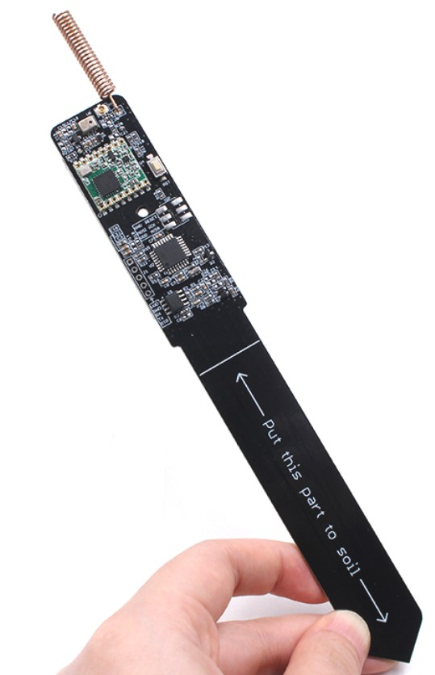
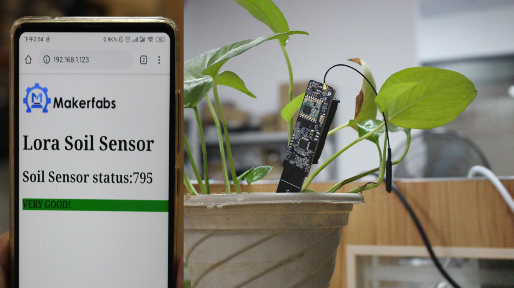
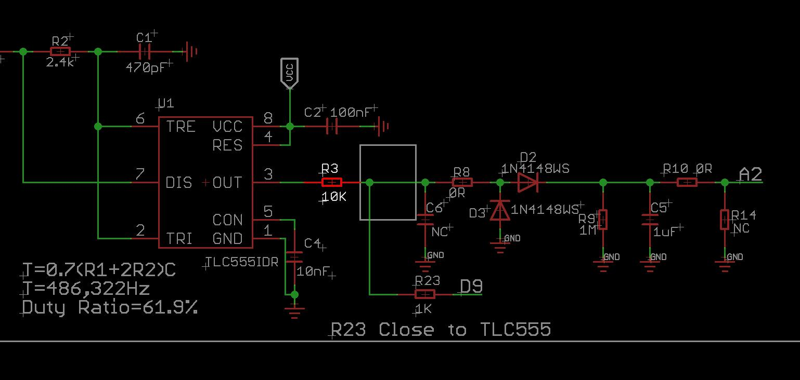
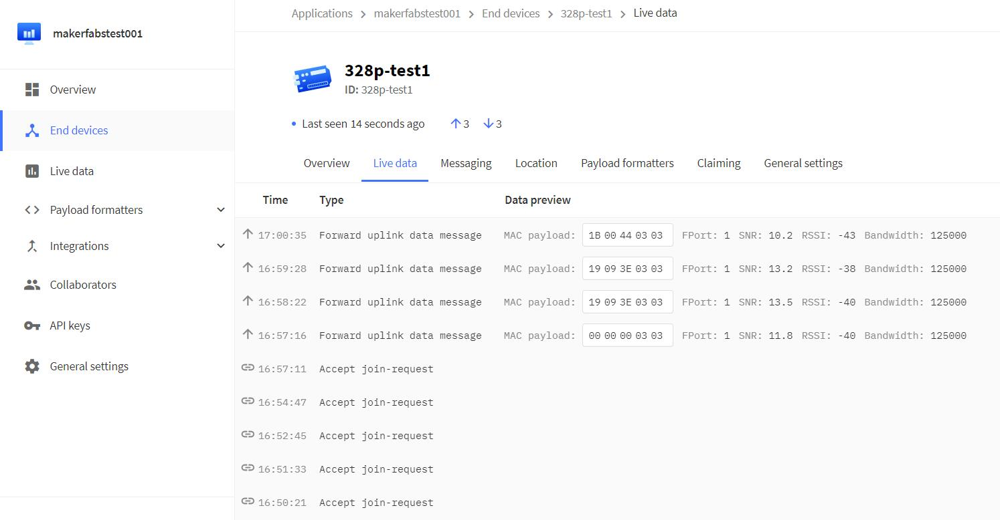
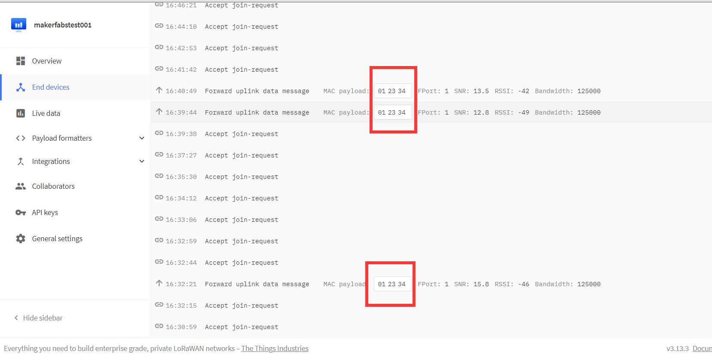

# Lora-Soil-Moisture-Sensor

```c++
/*
Version:		V3.1
Author:			UNKOWN
Create Date:	UNKOWN
Note:
	2021/8/24	V3.1: Now can read ADC value without 555.
	2021/7/22	V3.0: Now support Lorawan to TTN.
	2020/10/26	v2.2: Add a power-save verson.Using watch dog and sleep mode.
	2020/8/24	v2.1: Add pcb file.
    2020/7/24	v2.0: Rebuid readme,add pic. By Vincent
*/
```

[toc]

# Introduce

The Lora soil moisture sensor is based on Atmel's Atmega328P, it collect local air temperature/ humidity with sensor AHT10, and detect the soil humidity with capacitor-humility measurement solution with 555, and transmit the local environment data to the gateway, with Lora communication, suit for applications for smart-farm, irrigation, agriculture, etc.



- You can get one from: [Lora_Soil_Moisture_Sensor](https://www.makerfabs.com/lora-soil-moisture-sensor.html)

- Hardware and detailed instructions please visit Wiki page:  [Lora_Soil_Moisture_Sensor Wiki](https://www.makerfabs.com/wiki/index.php?title=Lora_Soil_Moisture_Sensor)

# Related Projects

## [Project_Soil-Moisture-Sensor-Wifi](https://github.com/Makerfabs/Project_Soil-Moisture-Sensor-Wifi)

- Control relay through wifi.

- [youtube:Lora soil moisture wifi](https://youtu.be/1wYAwtzNxJU)



## [Lora IoT Irrigation System](https://github.com/Makerfabs/Project_IoT-Irrigation-System)

- IoT agricultural irrigation experiment based on Lora communication.
- [YOUTUBE:Lora IoT Irrigation System - Outdoor Simulation Test](https://youtu.be/0mY6Ox0YvRk)


# Example List

## LoraTransmitterADCAHT10

Default factory firmware, can measure air temperature and humidity and soil moisture, and send through Lora.


## PowerSaveMode_SoilSensor

By putting the 328p and SX1278 to sleep, you can reduce power consumption by waking them up regularly.


## lora_soil_no555

Instead of the 555 chip, we can divide the clock source by 328P.

Need to remove the R3 resistor from the PCB. And ADC results may be different from previous ones, around 910 in air and 740 in water.




## Lorawan

An example of connecting to Lorawan is provided.For details on how to set TTN, see the Wiki：[Maduino_Zero_LoRaWAN_Node](https://www.makerfabs.com/wiki/index.php?title=Maduino_Zero_LoRaWAN_Node)

**Only supporting the EU-868 and US-915**

### Setup Library

Download from ：[arduino-lmic](https://github.com/matthijskooijman/arduino-lmic)

And installer .zip library

### Set EUI

To connect through OTAA, you need to replace the following code with your own DEVEUI, APPEUI, and APPKEY.

Notice that DEVEUI and APPEUI are little-endian, but APPKEY is big endian.

```c++
// This EUI must be in little-endian format, so least-significant-byte
// first. When copying an EUI from ttnctl output, this means to reverse
// the bytes. For TTN issued EUIs the last bytes should be 0xD5, 0xB3,
// 0x70.
//70B3D57ED0041DA0
//static const u1_t PROGMEM APPEUI[8]={ 0x70, 0xB3, 0xD5, 0x7E, 0xD0, 0x04, 0x1D, 0xA0 };
static const u1_t PROGMEM APPEUI[8]={ 0xA0, 0x1D, 0x04, 0xD0, 0x7E, 0xD5, 0xB3, 0x70 };
void os_getArtEui (u1_t* buf) { memcpy_P(buf, APPEUI, 8);}

// This should also be in little endian format, see above.
//D896E0FF00000888
//static const u1_t PROGMEM DEVEUI[8]={ 0xD8, 0x96, 0xE0, 0xFF, 0x00, 0x00, 0x08, 0x88 };
static const u1_t PROGMEM DEVEUI[8]={ 0x88, 0x08, 0x00, 0x00, 0xFF, 0xE0, 0x96, 0xD8 };
void os_getDevEui (u1_t* buf) { memcpy_P(buf, DEVEUI, 8);}

// This key should be in big endian format (or, since it is not really a
// number but a block of memory, endianness does not really apply). In
// practice, a key taken from ttnctl can be copied as-is.
// The key shown here is the semtech default key.
//DBA8 0380 77B1 42A7 3CFA D1EB 2F0C 8FC4
static const u1_t PROGMEM APPKEY[16] = { 0xDB, 0xA8, 0x03, 0x80, 0x77, 0xB1, 0x42, 0xA7, 0x3C, 0xFA, 0xD1, 0xEB, 0x2F, 0x0C, 0x8F, 0xC4 };
//static const u1_t PROGMEM APPKEY[16] = { 0xC4, 0x8F, 0x0C, 0x2F, 0xEB, 0xD1, 0xFA, 0x3C, 0xA7, 0x42, 0xB1, 0x77, 0x80, 0x03, 0xA8, 0xDB };
void os_getDevKey (u1_t* buf) {  memcpy_P(buf, APPKEY, 16);}
```

The code locations are /lorawan/OTAA_328p and /lorawan/OTAA_soil.

It takes a long, patient wait to connect, about 3 to 10 minutes. I don't know why.





